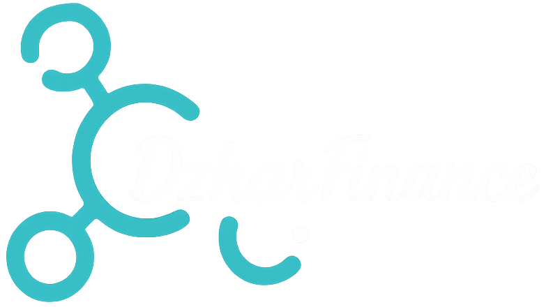

# 🏦 DzharFinance

> **Smart way to manage your money, time, and news** — A comprehensive personal finance & lifestyle management web application built with vanilla HTML, CSS, and JavaScript.



---

## 📸 Preview

### 🏠 Homepage / Landing Page

<table>
<tr>
<td width="50%">

#### 🌈 Hero Section
```html
<!-- index.html - Hero Section -->
<section id="heroSection" class="hero-section">
  <div class="hero-background">
    
    
    
    <div class="hero-overlay"></div>
  </div>
  <div class="hero-content">
    
    <h1 class="hero-title">
      Smart way to manage your<br>
      <span class="highlight">money, time, and news</span>
    </h1>
    <p class="hero-subtitle">
      All-in-one platform for finance tracking, 
      schedule management, weather updates, and latest news.
    </p>
    <a href="login.html" class="btn-get-started" id="getStartedBtn">
      Get Started Today
    </a>
  </div>
</section>
```
```css
/* css/style.css - Hero Styling */
.hero-section {
  position: relative;
  height: 100vh;
  display: flex;
  align-items: center;
  justify-content: center;
  overflow: hidden;
}
.hero-background {
  position: absolute;
  inset: 0;
  z-index: -1;
}
.hero-bg {
  position: absolute;
  inset: 0;
  width: 100%;
  height: 100%;
  object-fit: cover;
  opacity: 0;
  transition: opacity 1.5s ease-in-out;
}
.hero-bg.active { opacity: 1; }
.hero-overlay {
  position: absolute;
  inset: 0;
  background: linear-gradient(135deg, rgba(13,13,13,0.85), rgba(7,140,212,0.3));
}
.hero-title {
  font-size: clamp(2.5rem, 6vw, 4.5rem);
  font-weight: 700;
  line-height: 1.2;
  color: #fff;
}
.highlight { color: #05c227; }
```

</td>
<td width="50%">


*Auto-rotating hero background (3 images, 5s interval)*

</td>
</tr>
<tr>
<td>

#### 🌍 Language Switcher & Navigation
```html
<!-- Fixed Topbar with Language Selector -->
<header class="topbar">
  <nav class="nav-container">
    <div class="nav-left">
      <a href="#" class="logo"></a>
    </div>
    <div class="nav-center">
      <a href="#features">Features</a>
      <a href="#about">About</a>
      <a href="#contact">Contact</a>
    </div>
    <div class="nav-right">
      <div class="lang-switcher">
        <button class="lang-btn active" data-lang="en">EN</button>
        <button class="lang-btn" data-lang="id">ID</button>
      </div>
      <a href="register.html" class="btn-signup">Sign Up</a>
      <button class="burger" id="burgerMenu">☰</button>
    </div>
  </nav>
</header>
```

</td>
<td>


*Responsive navigation with EN/ID language switcher*

</td>
</tr>
<tr>
<td colspan="2">

#### ✨ Features Grid
```html
<!-- Features Section - 4 Feature Cards -->
<section id="features" class="features-section">
  <h2 class="section-title">Why Choose DzharFinance?</h2>
  <div class="features-grid">
    <!-- Feature 1: Finance -->
    <a href="dashboard.html" class="feature-card">
      <div class="feature-icon finance">💰</div>
      <h3>Manage Finances</h3>
      <p>Record income & expenses with visual charts and USD conversion</p>
    </a>
    <!-- Feature 2: Time Management -->
    <a href="reminder.html" class="feature-card">
      <div class="feature-icon reminder">⏰</div>
      <h3>Time Management</h3>
      <p>Daily reminders with notifications & weekly schedule integration</p>
    </a>
    <!-- Feature 3: Weather -->
    <a href="weather.html" class="feature-card">
      <div class="feature-icon weather">🌤️</div>
      <h3>Weather Updates</h3>
      <p>Real-time weather with interactive map & 5-day forecast charts</p>
    </a>
    <!-- Feature 4: News -->
    <a href="news.html" class="feature-card">
      <div class="feature-icon news">📰</div>
      <h3>Latest News</h3>
      <p>Indonesian news feed with infinite scroll & search</p>
    </a>
  </div>
</section>
```

</td>
</tr>
<tr>
<td colspan="2" align="center">


*4 Core Features: Finance • Reminder • Weather • News*

</td>
</tr>
</table>

---

### 📱 All Pages Overview

| Page | Preview | Description | Key Technologies |
|------|---------|-------------|------------------|
| **🏠 Landing** |  | Hero, features, about, contact | CSS Animations, IntersectionObserver |
| **🔐 Login** |  | Email/password auth vs Firebase | Firebase REST API, localStorage |
| **📝 Register** |  | New user registration | Firebase POST, validation |
| **💰 Dashboard** |  | Finance tracker with charts | Chart.js, Frankfurter API, Firebase |
| **⏰ Reminder** |  | Daily reminders + weekly schedule | Notifications API, sessionStorage |
| **📅 Schedule** |  | Weekly planner (Mon-Sun) | Firebase PUT/GET, dynamic forms |
| **🌤️ Weather** |  | Current + 5-day forecast + map | OpenWeatherMap, Leaflet.js, Chart.js |
| **📰 News** |  | Indonesian news with infinite scroll | NewsData.io API, IntersectionObserver |

---

## ✨ Features

### 💰 **Finance Dashboard** (`dashboard.html`)
- **Wallet Management** — Store HP/DANA numbers, auto-fetch from Firebase
- **Income/Expense Tracking** — Add transactions with categories
- **Visual Analytics** — Chart.js bar chart (Income vs Expenses)
- **Multi-Currency** — Real-time IDR → USD conversion via Frankfurter API
- **Persistent Storage** — All data synced to Firebase Realtime Database

### ⏰ **Time Management** (`reminder.html`)
- **Daily Reminders** — Max 5 per day with time-based notifications
- **Progress Tracking** — Circular progress bar (completed/total)
- **Weekly Schedule View** — Auto-loads from `jadwal.html` data
- **Browser Notifications** — Requests permission, triggers at exact time
- **Offline-First** — Uses `sessionStorage` per user

### 📅 **Weekly Planner** (`jadwal.html`)
- **7-Day Grid** — Monday through Sunday cards
- **Per-Day Motivation** — Custom motivational text area
- **Dynamic Activities** — Add/remove up to 6 time-slot tasks per day
- **Firebase Sync** — Saved to `/schedule/{userId}.json` via PUT
- **Success Modal** — Custom animated confirmation popup

### 🌤️ **Weather Center** (`weather.html`)
- **City Search** — OpenWeatherMap geocoding + current weather
- **Interactive Map** — Leaflet.js + OpenStreetMap with temp marker
- **5-Day Forecast** — Chart.js line chart (temp trends)
- **Auto-Location** — Browser Geolocation API (fallback: Bandung)
- **Responsive Cards** — Humidity, wind, condition icons

### 📰 **News Feed** (`news.html`)
- **Search & Filter** — Debounced input (650ms) + category filter
- **Infinite Scroll** — Loads next page on scroll-bottom
- **Indonesian Sources** — NewsData.io with `country=id`
- **Rich Cards** — Image, source badge, truncated description, read-more link
- **Fallback Images** — SVG placeholder for missing thumbnails

---

## 🛠 Tech Stack

| Category | Technologies |
|----------|-------------|
| **Frontend** | HTML5, CSS3 (Custom Properties, Grid, Flexbox), Vanilla JS (ES6+) |
| **Charts** | [Chart.js](https://www.chartjs.org/) v4 (CDN) |
| **Maps** | [Leaflet.js](https://leafletjs.com/) + OpenStreetMap |
| **Fonts & Icons** | Google Fonts: Poppins, Material Symbols, Material Icons |
| **Backend (BaaS)** | [Firebase Realtime Database](https://firebase.google.com/products/realtime-database) (REST API) |
| **External APIs** | OpenWeatherMap, NewsData.io, Frankfurter (Currency) |
| **Auth** | Custom localStorage/sessionStorage (no Firebase Auth) |
| **Deployment** | Static hosting (GitHub Pages, Netlify, Vercel, Firebase Hosting) |

### 🔑 API Keys (⚠️ Store Securely in Production!)
```js
// js/weather.js
const OPENWEATHER_API_KEY = 'YOUR_OPENWEATHER_API_KEY';

// js/news.js
const NEWS_API_KEY = 'YOUR_NEWSDATA_API_KEY';

// js/dashboard.js
const FRANKFURTER_API = 'https://api.frankfurter.dev/v1/latest?from=IDR&to=USD';

// Firebase Endpoint
const FIREBASE_BASE = 'YOUR_FIREBASE_PROJECT_URL';
```

> ⚠️ **Security Note**: API keys and Firebase endpoints should be stored securely. For production, use Firebase Auth + Security Rules, and proxy external APIs through a backend. Never commit real API keys to version control.

---

## 📁 Project Structure

```
dzharfinance/
├── index.html                 # 🏠 Landing page
├── assets/                    # 📸 Images, videos, icons
│   ├── logooo.png            # Main logo
│   ├── mk.png                # Favicon / nav logo
│   ├── indexx.jpg            # Hero bg 1
│   ├── a.png                 # Hero bg 2
│   ├── r.png                 # Hero bg 3
│   ├── hihi.mp4              # Hero video (Why Choose)
│   ├── vvid.mp4              # Loading transition video
│   └── *.jpg, *.png          # Feature illustrations
├── css/
│   ├── style.css             # 🏠 Landing (1144 lines)
│   ├── dashboard.css         # 💰 Finance (1165 lines)
│   ├── login.css             # 🔐 Login (597 lines)
│   ├── register.css          # 📝 Register (imports login.css)
│   ├── reminder.css          # ⏰ Reminder (1687 lines)
│   ├── weather.css           # 🌤️ Weather (1292 lines)
│   ├── news.css              # 📰 News (1107 lines)
│   └── jadwal.css            # 📅 Schedule (1200 lines)
├── js/
│   ├── script.js             # 🏠 Landing logic (164 lines)
│   ├── login.js              # 🔐 Auth (87 lines)
│   ├── register.js           # 📝 Register (90 lines)
│   ├── dashboard.js          # 💰 Finance (355 lines)
│   ├── reminder.js           # ⏰ Reminder (424 lines)
│   ├── jadwal.js             # 📅 Schedule (186 lines)
│   ├── weather.js            # 🌤️ Weather (225 lines)
│   └── news.js               # 📰 News (174 lines)
└── html/
    ├── login.html
    ├── register.html
    ├── dashboard.html
    ├── reminder.html
    ├── jadwal.html
    ├── weather.html
    └── news.html
```

---

## 🚀 Quick Start

### Prerequisites
- Any static file server (no Node.js/build tools required)
- Modern browser with ES6+ support
- Internet connection (for CDN libs & APIs)

### Local Development

```bash
# Option 1: Python (built-in on most systems)
python -m http.server 8080
# → Open http://localhost:8080

# Option 2: Node.js (npx serve)
npx serve .
# → Open shown URL

# Option 3: PHP
php -S localhost:8080

# Option 4: VS Code Live Server extension
# Right-click index.html → "Open with Live Server"
```

### Deploy to GitHub Pages
```bash
# 1. Push to GitHub
git add .
git commit -m "feat: initial DzharFinance release"
git push origin main

# 2. Enable GitHub Pages
# Settings → Pages → Source: "Deploy from branch" → main / (root)
# 3. Your site: https://<username>.github.io/dzharfinance/
```

### Deploy to Netlify / Vercel / Firebase Hosting
```bash
# Netlify (drag & drop folder, or connect Git repo)
# Vercel: npx vercel --prod
# Firebase: firebase init hosting → firebase deploy
```

---

## 🔐 Authentication Flow

```
┌─────────────┐     ┌──────────────────┐     ┌─────────────────┐
│  Register   │────▶│  Firebase POST   │────▶│  localStorage   │
│  (email/pw) │     │  /users.json     │     │  isLoggedIn=true│
└─────────────┘     └──────────────────┘     │  userId=uid     │
                                             └────────┬────────┘
                                                      │
                    ┌─────────────────────────────────┘
                    ▼
┌─────────────┐     ┌──────────────────┐
│   Login     │────▶│  Firebase GET    │
│  (email/pw) │     │  /users.json     │
└─────────────┘     └────────┬─────────┘
                             │ match found?
                    ┌────────┴────────┐
                    ▼               ▼
              ✅ Success        ❌ Fail
                    │               │
                    ▼               ▼
           localStorage.set      alert("Invalid")
           window.location.href
                    │
                    ▼
           ┌──────────────────┐
           │  index.html      │
           │  (logged-in UI)  │
           └──────────────────┘
```

---

## 💾 Data Models (Firebase)

### `/users.json`
```json
{
  "uid_abc123": {
    "email": "user@example.com",
    "password": "HASHED_PASSWORD",   // ⚠️ Never store plain text!
    "nomorHP": "08123456789",
    "nomorDana": "08123456789",
    "createdAt": "2025-01-15T10:30:00.000Z"
  }
}
```

### `/cards.json`
```json
{
  "uid_abc123": {
    "nomorHP": "08123456789",
    "nomorDana": "08123456789"
  }
}
```

### `/transactions.json`
```json
{
  "uid_abc123": [
    {
      "id": "txn_001",
      "type": "income",           // "income" | "expense"
      "amount": 5000000,
      "description": "Gaji Januari",
      "date": "2025-01-01",
      "createdAt": "2025-01-01T08:00:00.000Z"
    }
  ]
}
```

### `/schedule/{userId}.json`
```json
{
  "Monday": {
    "motivation": "Start strong!",
    "activities": [
      {"time": "08:00", "task": "Gym"},
      {"time": "10:00", "task": "Meeting"}
    ]
  },
  "Tuesday": { ... }
}
```

---

## 🎨 Design System

### Color Palette (CSS Variables)
```css
:root {
  /* Primary */
  --dark-bg: #0d0d0d;
  --dark-card: #111;
  --primary-blue: #078cd4;
  --primary-green: #05c227;
  --primary-yellow: #f7b801;
  --danger-red: #e74c3c;
  
  /* Text */
  --text-main: #273442;
  --text-muted: #667085;
  --text-white: #ffffff;
  
  /* Gradients */
  --grad-blue-green: linear-gradient(135deg, #078cd4, #05c227);
  --grad-dark: linear-gradient(135deg, #0d0d0d, #1a1a1a);
}
```

### Typography
```css
@import url('https://fonts.googleapis.com/css2?family=Poppins:wght@400;500;600;700&display=swap');
font-family: 'Poppins', sans-serif;
```

### Spacing & Radius
```css
--space-xs: 4px;  --space-sm: 8px;  --space-md: 16px;
--space-lg: 24px; --space-xl: 32px; --space-2xl: 48px;
--radius-sm: 8px; --radius-md: 12px; --radius-lg: 18px;
--radius-xl: 24px; --radius-full: 999px;
```

### Shadows & Effects
```css
--shadow-sm: 0 2px 8px rgba(0,0,0,0.08);
--shadow-md: 0 8px 24px rgba(0,0,0,0.12);
--shadow-lg: 0 16px 48px rgba(0,0,0,0.16);
--glass: rgba(255,255,255,0.96);
--glass-blur: backdrop-filter: blur(12px);
```

---

## 📱 Responsive Breakpoints

```css
/* Mobile-first approach with max-width queries */
@media (max-width: 1250px) { /* Tablet landscape / small laptop */ }
@media (max-width: 900px)  { /* Tablet portrait */ }
@media (max-width: 768px)  { /* Large phone */ }
@media (max-width: 700px)  { /* Standard phone */ }
@media (max-width: 600px)  { /* Small phone */ }
@media (max-width: 560px)  { /* Compact */ }
@media (max-width: 520px)  { /* Very compact */ }
@media (max-width: 390px)  { /* iPhone SE / mini */ }
@media (max-width: 380px)  { /* Ultra compact */ }
```

### Mobile Navigation (≤1250px)
```html
<!-- Fixed bottom dock - shows on all feature pages -->
<nav class="mobile-bottom-nav">
  <a href="index.html" class="nav-item"><span>🏠</span><span>Home</span></a>
  <a href="dashboard.html" class="nav-item"><span>💰</span><span>Finance</span></a>
  <a href="reminder.html" class="nav-item"><span>⏰</span><span>Reminder</span></a>
  <a href="jadwal.html" class="nav-item"><span>📅</span><span>Schedule</span></a>
  <a href="weather.html" class="nav-item"><span>🌤️</span><span>Weather</span></a>
  <a href="news.html" class="nav-item"><span>📰</span><span>News</span></a>
</nav>
```

---

## 🔧 Key Code Snippets

### Language Switcher (Landing Page)
```js
// js/script.js - Lines 1-50
const translations = {
  en: { heroTitle: "Smart way to manage your money, time, and news", ... },
  id: { heroTitle: "Cara cerdas mengelola uang, waktu, dan berita", ... }
};

document.querySelectorAll('.lang-btn').forEach(btn => {
  btn.addEventListener('click', () => {
    document.querySelectorAll('.lang-btn').forEach(b => b.classList.remove('active'));
    btn.classList.add('active');
    const lang = btn.dataset.lang;
    document.querySelectorAll('[data-i18n]').forEach(el => {
      const key = el.dataset.i18n;
      if (translations[lang][key]) el.textContent = translations[lang][key];
    });
    localStorage.setItem('preferredLang', lang);
  });
});
```

### Firebase REST Helper (Reusable Pattern)
```js
// Used in dashboard.js, reminder.js, jadwal.js
const FB = 'https://dzhar-schedule-api-default-rtdb.firebaseio.com/';

async function fbGet(path) {
  const res = await fetch(`${FB}${path}.json`);
  return res.ok ? res.json() : null;
}

async function fbPut(path, data) {
  await fetch(`${FB}${path}.json`, {
    method: 'PUT',
    headers: { 'Content-Type': 'application/json' },
    body: JSON.stringify(data)
  });
}

async function fbPost(path, data) {
  const res = await fetch(`${FB}${path}.json`, {
    method: 'POST',
    headers: { 'Content-Type': 'application/json' },
    body: JSON.stringify(data)
  });
  return res.json(); // Returns { name: "generated-id" }
}
```

### Chart.js Bar Chart (Dashboard)
```js
// js/dashboard.js - Lines 180-220
const ctx = document.getElementById('financeChart').getContext('2d');
new Chart(ctx, {
  type: 'bar',
  data: {
    labels: ['Income', 'Expense'],
    datasets: [{
      label: 'Amount (IDR)',
      data: [totalIncome, totalExpense],
      backgroundColor: ['rgba(5, 194, 39, 0.8)', 'rgba(231, 76, 60, 0.8)'],
      borderColor: ['#05c227', '#e74c3c'],
      borderWidth: 2,
      borderRadius: 12
    }]
  },
  options: {
    responsive: true,
    maintainAspectRatio: false,
    plugins: { legend: { display: false } },
    scales: { y: { beginAtZero: true, grid: { color: 'rgba(0,0,0,0.05)' } } }
  }
});
```

### Leaflet Map + Weather Marker (Weather Page)
```js
// js/weather.js - Lines 90-130
const map = L.map('weatherMap').setView([lat, lon], 10);
L.tileLayer('https://{s}.tile.openstreetmap.org/{z}/{x}/{y}.png', {
  attribution: '© OpenStreetMap contributors'
}).addTo(map);

const marker = L.marker([lat, lon]).addTo(map);
marker.bindPopup(`<b>${city}</b><br>${temp}°C - ${desc}`).openPopup();

// Custom temperature icon
const tempIcon = L.divIcon({
  className: 'temp-marker',
  html: `<div style="background:#078cd4;color:#fff;padding:4px 8px;border-radius:6px;font-weight:600">${temp}°C</div>`,
  iconSize: [60, 30], iconAnchor: [30, 30]
});
L.marker([lat, lon], { icon: tempIcon }).addTo(map);
```

### Notification Scheduler (Reminder Page)
```js
// js/reminder.js - Lines 200-250
function checkReminders() {
  const now = new Date();
  const currentTime = now.toTimeString().slice(0, 5); // "HH:MM"
  const today = ['Minggu','Senin','Selasa','Rabu','Kamis','Jumat','Sabtu'][now.getDay()];
  
  const reminders = JSON.parse(sessionStorage.getItem(`reminders_${userId}_${today}`)) || [];
  
  reminders.forEach((r, i) => {
    if (!r.done && r.time === currentTime && Notification.permission === 'granted') {
      new Notification(`⏰ ${r.name}`, { 
        body: `Waktunya: ${r.name}`, 
        icon: 'assets/mk.png' 
      });
      // Auto-mark done after notification
      reminders[i].done = true;
      saveReminders();
      renderReminders();
    }
  });
}
setInterval(checkReminders, 5000); // Check every 5 seconds
```

### Infinite Scroll News (News Page)
```js
// js/news.js - Lines 100-140
let currentPage = 1, isLoading = false, hasMore = true;

async function loadNews(page = 1) {
  if (isLoading || !hasMore) return;
  isLoading = true;
  showLoader();
  
  const url = `https://newsdata.io/api/1/news?apikey=${NEWS_API_KEY}&country=id&language=id&page=${page}&size=10`;
  const res = await fetch(url);
  const data = await res.json();
  
  if (data.results?.length) {
    data.results.forEach(article => appendNewsCard(article));
    currentPage = page;
    hasMore = data.nextPage !== undefined;
  } else hasMore = false;
  
  hideLoader();
  isLoading = false;
}

// IntersectionObserver for infinite scroll
const observer = new IntersectionObserver((entries) => {
  if (entries[0].isIntersecting && !isLoading) loadNews(currentPage + 1);
});
observer.observe(document.getElementById('loadTrigger'));
```

---

## 🌐 Internationalization (i18n)

Landing page supports **English** & **Indonesian** via data attributes:

```html
<!-- index.html -->
<h1 data-i18n="heroTitle">Smart way to manage your money, time, and news</h1>
<p data-i18n="heroSubtitle">All-in-one platform...</p>
<button data-i18n="getStarted">Get Started Today</button>
```

```js
// js/script.js - Translation object
const translations = {
  en: {
    heroTitle: "Smart way to manage your money, time, and news",
    heroSubtitle: "All-in-one platform for finance tracking...",
    getStarted: "Get Started Today",
    featuresTitle: "Why Choose DzharFinance?",
    // ... 30+ keys
  },
  id: {
    heroTitle: "Cara cerdas mengelola uang, waktu, dan berita",
    heroSubtitle: "Platform all-in-one untuk pelacuan keuangan...",
    getStarted: "Mulai Sekarang",
    featuresTitle: "Mengapa Memilih DzharFinance?",
    // ... 30+ keys
  }
};
```

To add a new language:
1. Add translation object to `translations`
2. Add `<button class="lang-btn" data-lang="xx">XX</button>` in HTML
3. Add `data-i18n` attributes to all text elements

---

## 🔒 Security Considerations

| Issue | Current State | Recommendation |
|-------|--------------|----------------|
| **Password Storage** | Plain text in Firebase | Use Firebase Auth + hashed passwords |
| **API Keys** | Exposed in client JS | Proxy via backend / Firebase Functions |
| **Firebase Rules** | Open (public read/write) | Set `.read/.write` rules per user UID |
| **HTTPS** | Required for Geolocation/Notifications | Deploy to HTTPS-only hosting |
| **CSP Headers** | None | Add Content-Security-Policy headers |

### Suggested Firebase Rules
```json
{
  "rules": {
    "users": {
      "$uid": {
        ".read": "$uid === auth.uid",
        ".write": "$uid === auth.uid"
      }
    },
    "cards": {
      "$uid": { ".read": "$uid === auth.uid", ".write": "$uid === auth.uid" }
    },
    "transactions": {
      "$uid": { ".read": "$uid === auth.uid", ".write": "$uid === auth.uid" }
    },
    "schedule": {
      "$uid": { ".read": "$uid === auth.uid", ".write": "$uid === auth.uid" }
    }
  }
}
```

---

## 📦 Dependencies (CDN)

```html
<!-- Chart.js v4 -->
<script src="https://cdn.jsdelivr.net/npm/chart.js"></script>

<!-- Leaflet.js v1.9+ -->
<link rel="stylesheet" href="https://unpkg.com/leaflet@1.9.4/dist/leaflet.css">
<script src="https://unpkg.com/leaflet@1.9.4/dist/leaflet.js"></script>

<!-- Google Fonts -->
<link rel="preconnect" href="https://fonts.googleapis.com">
<link rel="preconnect" href="https://fonts.gstatic.com" crossorigin>
<link href="https://fonts.googleapis.com/css2?family=Poppins:wght@400;500;600;700&display=swap" rel="stylesheet">
<link href="https://fonts.googleapis.com/css2?family=Material+Symbols+Outlined&display=swap" rel="stylesheet">
<link href="https://fonts.googleapis.com/css2?family=Material+Icons&display=swap" rel="stylesheet">
```

---

## 🧪 Testing Checklist

- [ ] **Landing Page**: Hero rotation, lang switcher, mobile nav, smooth scroll
- [ ] **Register**: Email validation, duplicate check, Firebase POST, redirect
- [ ] **Login**: Credential match, localStorage flags, redirect to index.html
- [ ] **Dashboard**: Card input, transaction CRUD, chart render, USD conversion
- [ ] **Reminder**: Add/edit/delete, notifications, progress ring, schedule load
- [ ] **Schedule**: 7-day form, dynamic activity rows, Firebase PUT, success modal
- [ ] **Weather**: Geolocation, city search, map render, forecast chart
- [ ] **News**: Search debounce, infinite scroll, image fallback, external links
- [ ] **Responsive**: Test all breakpoints (380px → 1440px+)
- [ ] **PWA**: Add manifest.json, service worker for offline support

---

## 🤝 Contributing

```bash
# 1. Fork the repository
# 2. Create feature branch
git checkout -b feature/amazing-feature

# 3. Make changes (follow existing code style)
# - 2-space indentation
# - CSS custom properties for colors/spacing
# - Vanilla JS (no frameworks)
# - Mobile-first responsive design

# 4. Commit with conventional messages
git commit -m "feat: add expense categories to dashboard"

# 5. Push and open Pull Request
git push origin feature/amazing-feature
```

### Code Style Guidelines
- **HTML**: Semantic elements, `data-i18n` for translatable text
- **CSS**: BEM-ish naming, CSS variables, mobile-first media queries
- **JS**: ES6+, async/await, modular functions, error handling with try/catch
- **Comments**: JSDoc for functions, inline for complex logic

---

## 📄 License

```
MIT License

Copyright (c) 2025 ican (@dzhar.hrahap)

Permission is hereby granted, free of charge, to any person obtaining a copy
of this software and associated documentation files (the "Software"), to deal
in the Software without restriction, including without limitation the rights
to use, copy, modify, merge, publish, distribute, sublicense, and/or sell
copies of the Software, and to permit persons to whom the Software is
furnished to do so, subject to the following conditions:

The above copyright notice and this permission notice shall be included in all
copies or substantial portions of the Software.

THE SOFTWARE IS PROVIDED "AS IS", WITHOUT WARRANTY OF ANY KIND, EXPRESS OR
IMPLIED, INCLUDING BUT NOT LIMITED TO THE WARRANTIES OF MERCHANTABILITY,
FITNESS FOR A PARTICULAR PURPOSE AND NONINFRINGEMENT. IN NO EVENT SHALL THE
AUTHORS OR COPYRIGHT HOLDERS BE LIABLE FOR ANY CLAIM, DAMAGES OR OTHER
LIABILITY, WHETHER IN AN ACTION OF CONTRACT, TORT OR OTHERWISE, ARISING FROM,
OUT OF OR IN CONNECTION WITH THE SOFTWARE OR THE USE OR OTHER DEALINGS IN THE
SOFTWARE.
```

---

## 👨‍💻 Author & Contact

| Platform | Link |
|----------|------|
| **GitHub** | [@yourusername](https://github.com/yourusername) |
| **Instagram** | [@dzhar.hrahap](https://instagram.com/dzhar.hrahap) |
| **Facebook** | [Profile](https://facebook.com/yourprofile) |

> Made with ❤️ by **ican** — *DzharFinance © 2025*

---

## 🙏 Acknowledgments

- [Chart.js](https://www.chartjs.org/) — Beautiful charts
- [Leaflet](https://leafletjs.com/) — Interactive maps
- [OpenWeatherMap](https://openweathermap.org/) — Weather data
- [NewsData.io](https://newsdata.io/) — News API
- [Frankfurter](https://www.frankfurter.dev/) — Exchange rates
- [Firebase](https://firebase.google.com/) — Realtime database
- [OpenStreetMap](https://www.openstreetmap.org/) — Map tiles
- [Google Fonts](https://fonts.google.com/) — Poppins & Material Icons

---

<div align="center">

**⭐ Star this repo if you find it useful!**

[](https://github.com/yourusername/dzharfinance/stargazers)
[](https://github.com/yourusername/dzharfinance/network/members)
[](LICENSE)

</div>